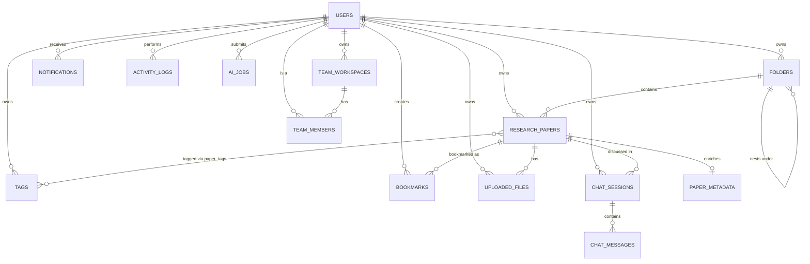

# Database Schema & Backend Foundation

This document covers the core data model added on top of authentication:
research papers, folders, tags, bookmarks, file metadata, chat, notifications,
the audit trail, and placeholder AI-job/team-workspace tables. AI processing,
PDF parsing, and research-specific business logic are still out of scope —
this is schema and CRUD plumbing only.

## Entity Relationship Diagram



## Tables

| Table | Purpose | Soft delete? |
| --- | --- | --- |
| `users`, `sessions`, `auth_providers`, `user_preferences` | From the auth phase — see [authentication.md](authentication.md). | No |
| `folders` | User-owned, self-nesting containers for papers. Unique per `(owner_id, parent_id, name)`. | Yes |
| `tags` | User-scoped labels (not global) attached to papers via `paper_tags`. | No — hard delete |
| `research_papers` | The core record: title, authors, venue, year, status, progress, folder placement. | Yes |
| `paper_metadata` | 1:1 enrichment data (DOI, arXiv ID, abstract, citation count, `extra` JSONB) — split out so a future PDF-parsing/enrichment job only ever writes here, never to `research_papers` itself. | No |
| `uploaded_files` | File **metadata only** — filename, size, storage path, checksum, processing status. No upload endpoint or byte storage exists yet; this just registers what a future upload will reference. | Yes |
| `chat_sessions` / `chat_messages` | Conversation persistence, optionally scoped to a paper. No AI generation is wired up — messages are stored verbatim as given. | Sessions: yes: messages: no |
| `bookmarks` | A user's saved papers, separate from `research_papers.status` so a note can be attached independently of reading-status workflow. Unique per `(user_id, paper_id)`. | No — hard delete |
| `notifications` | In-app notifications (`read_at` nullable = read/unread). No delivery channel (email/push) is implemented — nothing currently writes rows here except tests/future features. | No |
| `activity_logs` | Append-only audit trail. Written by `app/core/audit.py::record_activity` in the same transaction as the mutation it describes, never updated afterward. | No — append-only |
| `ai_jobs` | Placeholder job-tracking row (`job_type`, `status`, `payload`, `result` JSONB). Submitting a job only records intent; no worker executes it yet. | No |
| `team_workspaces` / `team_members` | Placeholder team schema. Creating a workspace auto-adds the creator as `role="owner"`. Only "must be a member" access control exists; granular permissions are future work. | Workspaces: yes; members: no |

## Cross-cutting features

- **UUID primary keys** — every table uses a `uuid4()` default (`UUIDPrimaryKeyMixin`), avoiding sequential-ID enumeration and making IDs safe to generate client-side before a row is persisted.
- **`created_at` / `updated_at`** — `TimestampMixin` on every table; `updated_at` refreshes via a server-side `onupdate=func.now()`.
- **Soft delete** — `SoftDeleteMixin` adds a nullable `deleted_at`. `BaseRepository` automatically excludes soft-deleted rows from `get`/`list_paginated` unless `include_deleted=True` is passed explicitly. Not every table needs this: append-only logs, join-adjacent rows (tags, bookmarks, chat messages, team members) hard-delete instead, since there's no "restore a deleted bookmark" use case worth the complexity.
- **Pagination / filtering / sorting** — `BaseRepository.list_paginated` (generic) and `PaperRepository.list_paginated_with_relations` (adds eager-loaded tags/metadata) both return `(items, total_count)`, which `PageParams.to_page()` turns into the standard envelope:
  ```json
  { "items": [...], "total": 42, "page": 1, "page_size": 20, "total_pages": 3 }
  ```
- **Audit logging** — any service mutation that should be traceable calls `record_activity(session, user_id=..., action=..., resource_type=..., resource_id=...)` using the *same* session as the mutation, so the log row commits or rolls back atomically with the change it describes.

## API endpoints added

All under `/api/v1`, all requiring authentication (see [authentication.md](authentication.md)) unless noted:

| Resource | Endpoints |
| --- | --- |
| Folders | `GET/POST /folders`, `GET/PATCH/DELETE /folders/{id}` |
| Tags | `GET/POST /tags`, `PATCH/DELETE /tags/{id}` |
| Papers | `GET/POST /papers` (paginated, filter by `status`/`folder_id`/`search`, sort by `created_at`/`updated_at`/`title`/`year`), `GET/PATCH/DELETE /papers/{id}`, `PUT /papers/{id}/metadata` |
| Bookmarks | `GET/POST /bookmarks`, `PATCH/DELETE /bookmarks/{id}` |
| Files | `GET/POST /files`, `GET/PATCH/DELETE /files/{id}` (metadata only) |
| Chat | `GET/POST /chat/sessions`, `GET/PATCH/DELETE /chat/sessions/{id}`, `POST /chat/sessions/{id}/messages` |
| Notifications | `GET /notifications`, `GET /notifications/unread-count`, `POST /notifications/{id}/read`, `POST /notifications/read-all` |
| Activity logs | `GET /activity-logs` (read-only) |
| AI jobs (placeholder) | `GET/POST /ai-jobs`, `GET /ai-jobs/{id}` |
| Team workspaces (placeholder) | `GET/POST /teams`, `GET/PATCH/DELETE /teams/{id}`, `GET/POST /teams/{id}/members`, `DELETE /teams/{id}/members/{member_id}` |
| Health/monitoring | `GET /health` (overall), `GET /health/live` (no dependency checks — process alive), `GET /health/ready` (checks Postgres + Redis), `GET /version` |

## Migration guide

Standard Alembic workflow, unchanged from the auth phase:

```bash
# after changing/adding a model, import it in app/db/base_registry.py, then:
alembic revision --autogenerate -m "describe the change"

# review the generated file in alembic/versions/ before applying —
# autogenerate is a starting point, not a guarantee (it won't detect
# every change, e.g. some check constraints or renames)
alembic upgrade head

# roll back one revision if something's wrong
alembic downgrade -1
```

The current chain: `initial auth tables` → `add research papers, files,
folders, tags, bookmarks, chat, notifications, activity logs, ai jobs, team
workspaces`. `tests/test_migrations.py` verifies both directions apply
cleanly against a real Postgres instance as part of the test suite.

## Development workflow for adding a new domain

1. **Model** (`app/models/<name>.py`) — inherit `ModelBase` (gives UUID `id` +
   timestamps) and `SoftDeleteMixin` if user-facing "delete" should be
   reversible. Import it in `app/db/base_registry.py`.
2. **Schema** (`app/schemas/<name>.py`) — `Create`/`Update`/`Response` Pydantic
   models; `Response` extends `TimestampedSchema`.
3. **Repository** (`app/repositories/<name>_repository.py`) — subclass
   `BaseRepository[Model]`; add only domain-specific queries (ownership
   lookups, uniqueness checks) beyond what the base class gives for free.
4. **Service** (`app/services/<name>_service.py`) — ownership checks, calls
   `record_activity` for anything worth auditing, raises domain exceptions
   from `app.core.exceptions` (never HTTP exceptions directly).
5. **Router** (`app/api/v1/routers/<name>.py`) — thin: parse request, call
   service, return response schema. Register in `app/api/v1/router.py`.
6. **Dependencies** (`app/api/deps.py`) — add a repo provider + service
   provider following the existing `Annotated[..., Depends(...)]` pattern.
7. **Migration** — `alembic revision --autogenerate`, review, apply.
8. **Tests** — at minimum: create/read/update/delete, ownership isolation
   (a second user can't see/touch the first user's rows), and any
   uniqueness/validation edge cases.
